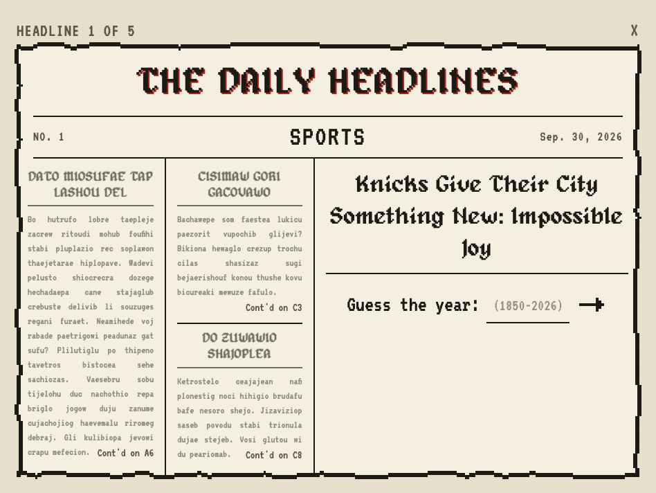
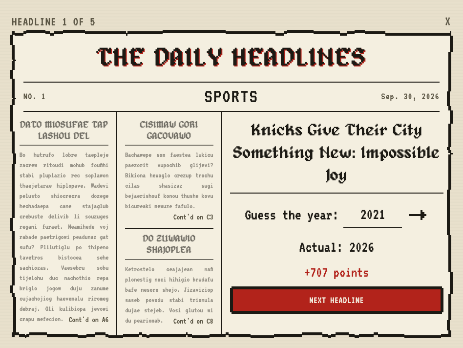
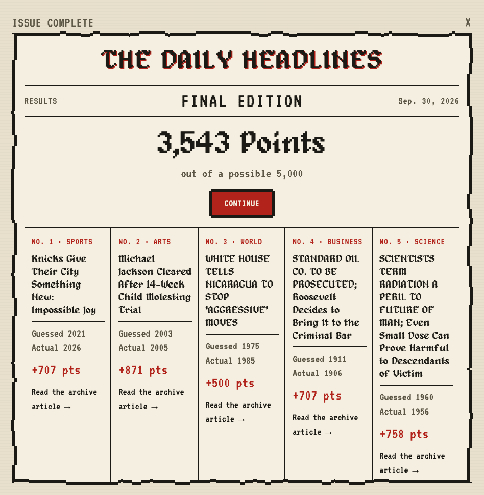
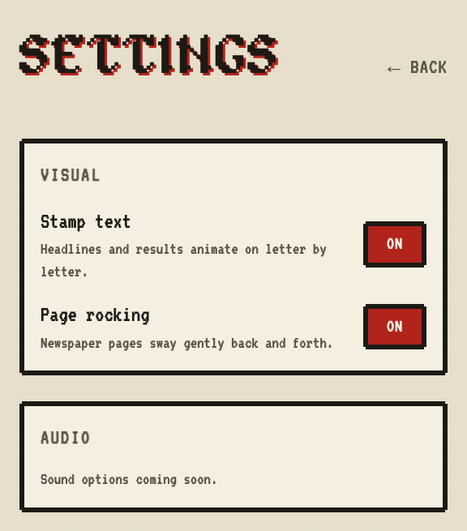

# headlines.io

**The Daily Headlines** — a daily headline-guessing game. Each day's issue is
five real headlines from the New York Times archives, one per newspaper page;
guess the year each was printed and score points for getting close.

**Play the beta:** https://headlines-six.vercel.app


## How it plays

Each headline gets its own pixel-art newspaper page: the real headline sits in
one of three columns, with made-up stories filling the others. Type a year,
submit, and the actual year and your points stamp onto the page.

| Guessing | Reveal |
| --- | --- |
|  |  |

After five headlines, the issue closes with a results page: your total as the
lead story, and a recap of every headline with your guess, the actual year,
points, and a link to the original archive article.



**Scoring:** up to 1,000 points per headline, halving for every 10 years
you're off (`1000 × 0.5^(years off / 10)`), so a guess in the right decade
still earns around half.

**Settings:** the letter-by-letter stamp animation and the gentle page rocking
can each be turned off. Both also stay off for players with reduced motion
enabled in their system settings.



## Repo layout

```
game/       the player-facing app (React + Vite), deployed as a static site
pipeline/   local tools for fetching, curating, and scheduling headlines (not shipped)
docs/       design doc, implementation plan, project notes, screenshots
```

## Running the game locally

```bash
cd game
npm install
npm run dev        # http://localhost:5173
```

`npm run dev` and `npm run build` first run `scripts/export-data.js`, which
copies the scheduled issues from `pipeline/data/` into `game/public/data/`.
That source data (`rounds.json`, `approved.json`) is gitignored, so a fresh
clone needs the pipeline run (below) before the game has anything to show.

The export strips anything that would give answers away in the browser's
Network tab: headlines get opaque ids, and each year + archive link is
obfuscated into a single string the game decodes only when a guess is
submitted. This deters casual peeking but isn't real security; that needs
server-side scoring (planned, see the design doc).

The day rolls over at **midnight UTC**. The home page also has a temporary
"Beta access — all issues" list for playing any scheduled issue on any day;
it goes away before launch.

## The content pipeline

Headlines go from the NYT archive to a scheduled issue in a few stages, all run
locally from `pipeline/`:

1. **Fetch** raw headlines from the NYT Archive API (`npm run fetch-nyt`, or
   `fetch-decades` / `fetch-all-years`). Needs `NYT_API_KEY` in
   `pipeline/.env` (see `.env.example`).
2. **Pre-score** them for game-worthiness with a local LLM
   (`npm run score-headlines`; needs [Ollama](https://ollama.com) running with
   `qwen2.5:14b`). Advisory only: it sorts what the reviewer sees first.
3. **Curate** in the browser UI (`npm run curate-ui`, http://localhost:5177):
   approve headlines with a difficulty and section, group exactly five into a
   pool, and assign pools to dates.
4. **Build** `rounds.json` from pools + schedule (`npm run build-rounds`).
   Issues whose date has already shipped are frozen and never rebuilt.

## Deploying

The site is plain static files, hosted on Vercel. Because the game's data
comes from gitignored pipeline files, it's built locally and the output is
uploaded, not built from the repo:

```bash
cd game
npm run build              # exports data + builds into game/dist
npx vercel dist --prod     # link to the existing "headlines" project when asked
```

Answer **No** to pulling environment variables into `.env.local`; anything in
`dist` gets published.

## Status

Playable end to end, and in beta with friends. Not built yet:

- Same-day stats ("you beat 72% of today's players"), which needs the small
  backend described in the design doc
- Sound (the Settings page has a spot waiting for it)
- Coffee-stain paper effects (built, currently switched off in
  `game/src/CoffeeStains.jsx`)

Background and design decisions: [docs/design-doc.md](docs/design-doc.md),
[docs/implementation-plan.md](docs/implementation-plan.md), and the latest
snapshot in [docs/project-state-2026-09-29.md](docs/project-state-2026-09-29.md).
